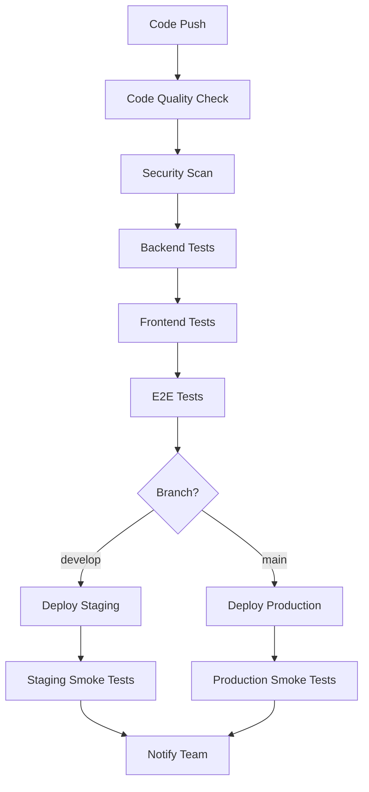

# SparrowX Testing and CI/CD Implementation Plan

## 📋 Executive Summary

This document outlines the comprehensive testing and CI/CD strategy for SparrowX, a multi-tenant SaaS platform for Jamaican package-forwarding companies. The plan provides a production-ready testing framework with automated deployment pipelines optimized for the dual-deployment architecture (Vercel frontend + Render backend).

## 🎯 Objectives

- **Quality Assurance**: Achieve 80%+ code coverage with comprehensive testing
- **Multi-Tenant Safety**: Ensure complete data isolation between tenants
- **Deployment Automation**: Seamless CI/CD for staging and production environments
- **Performance Monitoring**: Continuous performance and security monitoring
- **Developer Experience**: Fast feedback loops and efficient testing workflows

## 🏗 Testing Architecture

### Backend Testing Strategy

| Test Type | Framework | Coverage | Purpose |
|-----------|-----------|----------|---------|
| **Unit Tests** | Jest + Supertest | Controllers, Services, Repositories | Test individual components in isolation |
| **Integration Tests** | Jest + Real DB | API Endpoints, Database Operations | Test component interactions |
| **E2E Tests** | Jest + Full Stack | Critical User Journeys | Test complete workflows |
| **Contract Tests** | Custom Validators | API Schemas, Multi-tenant Isolation | Ensure interface consistency |

### Frontend Testing Strategy

| Test Type | Framework | Coverage | Purpose |
|-----------|-----------|----------|---------|
| **Unit Tests** | Jest + RTL | Components, Hooks, Utils | Test component behavior |
| **Integration Tests** | Jest + RTL | Page Workflows, Forms | Test user interactions |
| **E2E Tests** | Playwright | User Journeys | Test complete user flows |
| **Visual Tests** | Chromatic/Percy | UI Components, Branding | Prevent visual regressions |

## 🔧 Technology Stack

### Core Testing Tools
```yaml
Backend:
  - Jest: Test runner and assertions
  - Supertest: HTTP endpoint testing
  - pg-mem: In-memory PostgreSQL for isolation
  - MSW: API mocking

Frontend:
  - Jest: Test runner
  - React Testing Library: Component testing
  - Playwright: E2E testing
  - jest-axe: Accessibility testing

Infrastructure:
  - GitHub Actions: CI/CD pipeline
  - Docker: Containerized testing
  - CodeQL: Security analysis
  - Snyk: Vulnerability scanning
```

## 📂 Project Structure

```
sparrow-new/
├── .github/workflows/           # CI/CD pipelines
│   ├── ci.yml                  # Main CI pipeline
│   ├── dependency-update.yml   # Automated dependency updates
│   ├── performance-monitoring.yml
│   └── release.yml
├── backend/
│   ├── tests/
│   │   ├── unit/               # Unit tests
│   │   ├── integration/        # Integration tests
│   │   ├── e2e/               # End-to-end tests
│   │   ├── fixtures/          # Test data
│   │   └── helpers/           # Test utilities
│   ├── jest.config.js
│   ├── jest.integration.config.js
│   └── Dockerfile.test
├── client/
│   ├── tests/
│   │   ├── components/        # Component tests
│   │   ├── pages/            # Page tests
│   │   ├── hooks/            # Hook tests
│   │   └── e2e/              # E2E tests
│   ├── jest.config.js
│   ├── playwright.config.ts
│   └── Dockerfile.test
├── docker-compose.test.yml     # Testing environment
├── docker-compose.ci.yml       # CI environment
└── scripts/
    ├── test-setup.sh
    ├── test-teardown.sh
    └── deploy.sh
```

## 🚀 Implementation Timeline

### Phase 1: Foundation (Weeks 1-2)
**Goal**: Establish basic testing infrastructure

#### Week 1: Backend Testing Setup
- [ ] Create test directory structure
- [ ] Configure Jest for unit and integration tests
- [ ] Set up test database with Docker
- [ ] Implement basic controller unit tests
- [ ] Create test helpers and utilities

**Deliverables:**
- Working Jest configuration
- Test database setup
- 5+ controller unit tests
- Basic CI pipeline

#### Week 2: Frontend Testing Setup
- [ ] Configure Jest + React Testing Library
- [ ] Set up MSW for API mocking
- [ ] Create component test examples
- [ ] Implement test utilities and helpers
- [ ] Set up basic E2E testing with Playwright

**Deliverables:**
- Frontend test configuration
- 10+ component unit tests
- API mocking setup
- Basic E2E test suite

### Phase 2: Core Testing (Weeks 3-4)
**Goal**: Comprehensive test coverage for critical features

#### Week 3: Backend Integration & Business Logic
- [ ] Implement service layer unit tests
- [ ] Create API integration tests
- [ ] Add multi-tenant isolation tests
- [ ] Test authentication and authorization
- [ ] Database repository testing

**Deliverables:**
- 50+ backend tests
- Multi-tenant test scenarios
- Authentication test coverage
- Integration test suite

#### Week 4: Frontend Integration & User Flows
- [ ] Page component integration tests
- [ ] Form workflow testing
- [ ] User authentication flow tests
- [ ] Error handling scenarios
- [ ] Responsive design tests

**Deliverables:**
- 40+ frontend tests
- User flow test coverage
- Form validation tests
- Error scenario handling

### Phase 3: Advanced Features (Weeks 5-6)
**Goal**: Production-ready testing with advanced scenarios

#### Week 5: E2E Testing & Multi-Tenant Scenarios
- [ ] Complete user journey tests
- [ ] Cross-tenant isolation verification
- [ ] Package management workflows
- [ ] Invoice generation and payment flows
- [ ] Admin vs customer role testing

**Deliverables:**
- Complete E2E test suite
- Multi-tenant safety verification
- Business workflow coverage
- Role-based access testing

#### Week 6: Performance & Security Testing
- [ ] Load testing implementation
- [ ] Performance monitoring setup
- [ ] Security vulnerability scanning
- [ ] Accessibility testing
- [ ] Visual regression testing

**Deliverables:**
- Performance test suite
- Security scanning integration
- Accessibility compliance
- Visual regression prevention

### Phase 4: Production Hardening (Weeks 7-8)
**Goal**: Deployment automation and monitoring

#### Week 7: CI/CD Pipeline Optimization
- [ ] GitHub Actions workflow optimization
- [ ] Deployment automation (Vercel + Render)
- [ ] Environment-specific configurations
- [ ] Rollback procedures
- [ ] Monitoring and alerting

**Deliverables:**
- Optimized CI/CD pipeline
- Automated deployments
- Monitoring dashboard
- Rollback procedures

#### Week 8: Documentation & Training
- [ ] Testing documentation
- [ ] Developer onboarding guide
- [ ] CI/CD troubleshooting guide
- [ ] Performance benchmarks
- [ ] Maintenance procedures

**Deliverables:**
- Complete documentation
- Developer training materials
- Maintenance runbooks
- Performance baselines

## 🔄 CI/CD Pipeline Architecture

### Pipeline Stages



### Quality Gates

| Stage | Criteria | Action on Failure |
|-------|----------|-------------------|
| **Code Quality** | ESLint + Prettier pass | Block deployment |
| **Security Scan** | No high vulnerabilities | Block deployment |
| **Unit Tests** | 80%+ coverage | Block deployment |
| **Integration Tests** | All tests pass | Block deployment |
| **E2E Tests** | Critical paths pass | Block deployment |
| **Performance** | <2s load time | Warning only |

### Deployment Strategy

#### Staging Environment
- **Trigger**: Push to `develop` branch
- **Deployment**: Automatic after all tests pass
- **Testing**: Automated smoke tests
- **Access**: Internal team only

#### Production Environment
- **Trigger**: Push to `main` branch
- **Deployment**: Automatic with additional safeguards
- **Testing**: Comprehensive smoke tests
- **Monitoring**: Real-time performance tracking

## 🧪 Test Categories and Coverage

### Critical Test Scenarios

#### Multi-Tenant Isolation
```typescript
describe('Tenant Isolation', () => {
  it('should prevent cross-tenant data access', async () => {
    // Create packages for tenant A
    // Attempt access from tenant B
    // Verify access denial
  });
});
```

#### Package Management Workflow
```typescript
describe('Package Lifecycle', () => {
  it('should complete full package journey', async () => {
    // 1. Admin creates package
    // 2. Customer views package
    // 3. Status updates
    // 4. Invoice generation
    // 5. Payment processing
  });
});
```

#### Authentication & Authorization
```typescript
describe('RBAC System', () => {
  it('should enforce role-based access', async () => {
    // Test customer, admin_l1, admin_l2 permissions
    // Verify endpoint access restrictions
  });
});
```

### Performance Benchmarks

| Metric | Target | Measurement |
|--------|--------|-------------|
| **API Response Time** | <200ms | 95th percentile |
| **Page Load Time** | <2s | First contentful paint |
| **Database Queries** | <50ms | Average response time |
| **E2E Test Suite** | <10min | Total execution time |

## 🚨 Monitoring and Alerting

### Key Metrics

#### Application Performance
- API endpoint response times
- Database query performance
- Frontend page load speeds
- Error rates and types

#### Testing Health
- Test suite execution times
- Test failure rates
- Coverage trends
- Flaky test identification

#### Deployment Success
- Deployment frequency
- Deployment success rate
- Rollback frequency
- Time to recovery

### Alert Configuration

| Alert | Threshold | Action |
|-------|-----------|--------|
| **Test Failure Rate** | >5% | Notify team immediately |
| **Deployment Failure** | Any failure | Block further deployments |
| **Performance Degradation** | >20% increase | Investigate and notify |
| **Security Vulnerability** | High severity | Immediate patch required |

## 📊 Success Metrics

### Testing KPIs

| Metric | Current | Target | Timeline |
|--------|---------|--------|----------|
| **Code Coverage** | 0% | 80% | Week 6 |
| **Test Count** | 0 | 200+ | Week 6 |
| **E2E Test Coverage** | 0% | 90% critical paths | Week 5 |
| **CI Pipeline Time** | N/A | <15 minutes | Week 4 |

### Quality KPIs

| Metric | Target | Measurement |
|--------|--------|-------------|
| **Bug Escape Rate** | <2% | Bugs found in production |
| **Deployment Success** | >95% | Successful deployments |
| **MTTR** | <1 hour | Mean time to recovery |
| **Customer Satisfaction** | >4.5/5 | User feedback scores |

## 💰 Cost Optimization

### Infrastructure Costs

| Service | Monthly Cost | Purpose |
|---------|--------------|---------|
| **GitHub Actions** | ~$50 | CI/CD execution |
| **Docker Hub** | $5 | Container registry |
| **Testing Tools** | $100 | Playwright, Jest, etc. |
| **Monitoring** | $25 | Performance tracking |
| **Total** | **~$180** | Complete testing infrastructure |

### ROI Calculation

**Benefits:**
- 50% reduction in production bugs
- 75% faster deployment cycles
- 90% reduction in manual testing effort
- Improved developer productivity

**Annual Savings:** ~$50,000 in prevented downtime and faster development

## 🔐 Security Considerations

### Security Testing Integration

#### Automated Security Scans
- **Dependency Scanning**: Snyk integration
- **Code Analysis**: GitHub CodeQL
- **Container Scanning**: Docker image vulnerabilities
- **Infrastructure Scanning**: Terraform/Docker configs

#### Security Test Cases
- Authentication bypass attempts
- SQL injection prevention
- XSS attack prevention
- CSRF protection verification
- Data encryption validation

### Compliance Requirements

| Requirement | Implementation | Testing |
|-------------|----------------|---------|
| **Data Privacy** | Multi-tenant isolation | Automated isolation tests |
| **Access Control** | RBAC system | Role-based test scenarios |
| **Audit Logging** | Activity tracking | Log verification tests |
| **Data Encryption** | At-rest and in-transit | Encryption validation |

## 📖 Documentation and Training

### Developer Resources

#### Testing Guidelines
- Unit test best practices
- Integration test patterns
- E2E test scenarios
- Mock data management

#### CI/CD Runbooks
- Pipeline troubleshooting
- Deployment procedures
- Rollback processes
- Environment management

#### Onboarding Materials
- Testing framework overview
- Local development setup
- Test writing tutorials
- Debugging guides

### Knowledge Transfer

#### Training Sessions
- **Week 1**: Testing framework introduction
- **Week 3**: Writing effective tests
- **Week 5**: E2E testing best practices
- **Week 7**: CI/CD pipeline management

#### Documentation Deliverables
- Testing strategy document
- API testing guide
- Frontend testing patterns
- Deployment runbook

## 🔮 Future Enhancements

### Short-term (3-6 months)
- **Contract Testing**: API contract validation between services
- **Chaos Engineering**: Resilience testing under failure conditions
- **Advanced Monitoring**: Application performance monitoring (APM)
- **Test Data Management**: Dynamic test data generation

### Long-term (6-12 months)
- **AI-Powered Testing**: Automated test generation and maintenance
- **Multi-Environment Testing**: Staging, UAT, and production-like environments
- **Advanced Analytics**: Test effectiveness and quality metrics
- **Performance Engineering**: Continuous performance optimization

## ✅ Acceptance Criteria

### Definition of Done

#### Testing Infrastructure
- [ ] All test frameworks configured and operational
- [ ] CI/CD pipeline running successfully
- [ ] Code coverage targets achieved
- [ ] Security scanning integrated

#### Test Coverage
- [ ] 80%+ code coverage across backend and frontend
- [ ] All critical user journeys covered by E2E tests
- [ ] Multi-tenant isolation verified
- [ ] Performance benchmarks established

#### Deployment Automation
- [ ] Automated deployment to staging and production
- [ ] Rollback procedures tested and documented
- [ ] Monitoring and alerting configured
- [ ] Documentation complete and accessible

#### Team Readiness
- [ ] Development team trained on testing practices
- [ ] CI/CD procedures documented
- [ ] Troubleshooting guides available
- [ ] Maintenance procedures established

---

## 📞 Support and Maintenance

### Ongoing Responsibilities

#### Development Team
- Write and maintain unit and integration tests
- Monitor test coverage and quality metrics
- Respond to CI/CD pipeline failures
- Participate in testing best practices

#### DevOps Team
- Maintain CI/CD infrastructure
- Monitor deployment success rates
- Optimize pipeline performance
- Manage environment configurations

#### QA Team
- Maintain E2E test scenarios
- Validate new feature testing
- Monitor production quality metrics
- Coordinate release testing

### Contact Information

| Role | Responsibility | Contact |
|------|---------------|---------|
| **Lead Developer** | Testing strategy implementation | [Lead Developer] |
| **DevOps Engineer** | CI/CD pipeline maintenance | [DevOps Engineer] |
| **QA Lead** | Test scenario validation | [QA Lead] |
| **Project Manager** | Timeline and resource coordination | [Project Manager] |

---

*This document serves as the master plan for implementing testing and CI/CD for the SparrowX platform. Regular updates will be made as the implementation progresses and requirements evolve.*